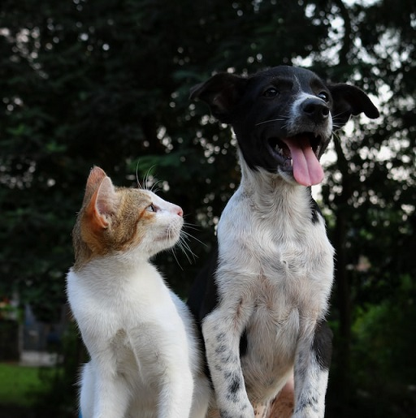
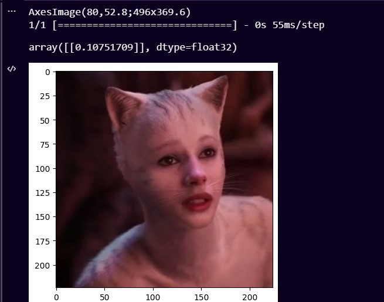

# Project Title

<h2>CNN with Tensorflow to classify images of cats and dogs</h2>

Photo by <a href="https://unsplash.com/@anushabarwa?utm_source=unsplash&utm_medium=referral&utm_content=creditCopyText">Anusha Barwa</a> on <a href="https://unsplash.com/s/photos/dog-cat?utm_source=unsplash&utm_medium=referral&utm_content=creditCopyText">Unsplash</a>
  

<!-- Add buttons here -->

In this project, I created a Convolutional Neural Network (CNN) using Tensorflow. Then, I used it to classify images of cats and dogs

# Demo-Preview

  

Ok... It's a cat as well

# Table of contents

- [Project Title](#project-title)
- [Demo-Preview](#demo-preview)
- [Table of contents](#table-of-contents)
- [Installation](#installation)
- [License](#license)
- [Footer](#footer)

# Installation
[(Back to top)](#table-of-contents)

- Clone this repository and unzip it
- After downloading, cd into the directory
- Begin a new virtual environment and activate it
- Install the required packages using pip install -r requirements.txt
- The Oxford-IIIT Pet dataset and annotations are roughly 800 MB in size and available for download via BitTorrent <a href="https://academictorrents.com/details/b18bbd9ba03d50b0f7f479acc9f4228a408cecc1">Torrent for dataset</a> . Copy it to the root of the project
- Use Ctrl+Enter to run the current cell or you can run multiple cells by selecting Run All, Run All Above, or Run All Below

# License
[(Back to top)](#table-of-contents)

<a href="LICENSE.md">MIT</a>

# Footer
[(Back to top)](#table-of-contents)

 
  

